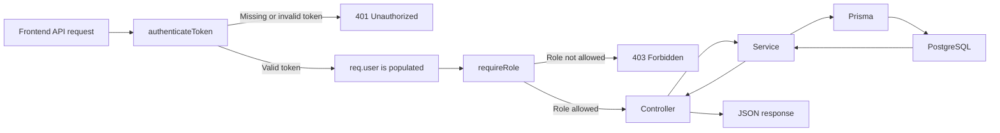
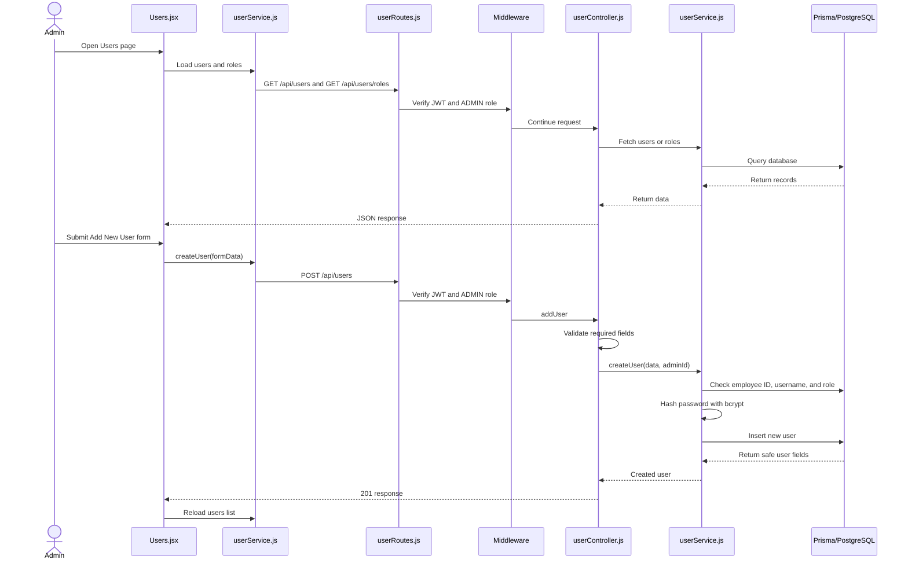

# Current Hospital Management System Flow

## Architecture

The project has two applications:

```text
Frontend/  React + Vite user interface
Backend/   Express API + Prisma database layer
```

The frontend runs normally on port `5173` and calls the backend on port `5000`.

## Complete application flow

```mermaid
flowchart TD
    A[Browser opens Frontend] --> B[main.jsx renders App]
    B --> C[React Router]
    C --> D[Login page at /]
    D -->|POST username and password| E[Express server]
    E --> F[/api/auth/login]
    F --> G[authController.login]
    G --> H[authService.loginUser]
    H --> I[Prisma queries PostgreSQL]
    I --> H
    H -->|bcrypt password check| J{Credentials valid?}
    J -->|No| K[Increment failed attempts or lock account]
    K --> D
    J -->|Yes| L[Create JWT and return user data]
    L --> M[Login.jsx stores token and user in localStorage]
    M --> N{User role}
    N -->|ADMIN| O[/dashboard]
    N -->|RECEPTION| P[/reception]
    N -->|BILLING| Q[/billing]
    O --> R[ProtectedRoute ADMIN]
    P --> S[ProtectedRoute RECEPTION]
    Q --> T[ProtectedRoute BILLING]
    R --> U[AdminDashboard with Outlet]
    S --> V[ReceptionDashboard with Outlet]
    T --> W[BillingDashboard with Outlet]
    U --> X[DashboardHome or Users]
    V --> Y[ReceptionHome]
    W --> Z[BillingHome]
```

## Backend startup flow

The backend starts in `Backend/server.js`:

1. `dotenv.config()` loads values from `Backend/.env`.
2. Express is created.
3. `express.json()` enables JSON request bodies.
4. `cors()` allows the frontend to call the backend.
5. Route modules are mounted:
   - `/api/auth`
   - `/api/users`
   - `/api/dashboard`
6. `connectPrisma()` connects to PostgreSQL.
7. Express listens on `PORT`, normally `5000`.

The Prisma client is created in `Backend/src/config/prisma.js`.

## Frontend routing flow

`Frontend/src/App.jsx` defines the main routes:

```text
/             Login
/dashboard    AdminDashboard, ADMIN only
/reception    ReceptionDashboard, RECEPTION only
/billing      BillingDashboard, BILLING only
```

The dashboard routes use nested routes. The parent dashboard renders the shared layout, and React Router's `<Outlet />` renders the selected child page inside that layout.

For example:

```text
/dashboard
    AdminDashboard
        DashboardHome
        Users
```

## Login flow

The login page is `Frontend/src/Login.jsx`.

1. The user enters a username and password.
2. The component sends `POST /api/auth/login`.
3. `authRoutes.js` maps the request to `authController.login`.
4. The controller checks that both fields exist.
5. `authService.loginUser` finds the user with Prisma.
6. The service checks account status.
7. `bcrypt.compare` checks the password hash.
8. Failed attempts are counted and the account is locked after five failures.
9. A successful login creates a JWT containing `userId`, `username`, and `role`.
10. The frontend stores the JWT and user object in `localStorage`.
11. The frontend navigates to the dashboard matching the user's role.

## Protected frontend route flow

`Frontend/src/admin/ProtectedRoute.jsx` is reused for all roles.

It checks:

```text
Token exists?
User object exists?
User JSON is valid?
User role matches allowedRoles?
```

If any check fails, the user is redirected to `/` or to the dashboard matching their actual role.

This is a user-interface guard. It does not replace backend authorization.

## Protected backend request flow

For a protected API request, the frontend sends:

```http
Authorization: Bearer <JWT>
```

The backend processes it like this:



## Reception flow currently implemented

The reception area is currently a dashboard shell:

```text
/reception
    ReceptionDashboard
        ReceptionHome
```

`ReceptionDashboard.jsx` provides:

- Hospital branding
- Reception staff identity from `localStorage`
- Sidebar navigation
- Logout behavior
- `<Outlet />` for child content

`ReceptionHome.jsx` requests:

```http
GET /api/dashboard/me
```

That endpoint is protected by:

```text
authenticateToken
requireRole("RECEPTION", "BILLING")
```

The dashboard service loads the current user from PostgreSQL and returns profile, role, status, and last-login information.

The New Patient and Patient Search sidebar actions are currently placeholders that show alerts. Patient registration and patient search have not been added to the current codebase.

## Admin user-management flow

The admin users page is available at `/dashboard/users`.



## Admin user-management endpoints

| Method | Endpoint | Purpose | Allowed role |
|---|---|---|---|
| `GET` | `/api/users` | List users, optionally filtered by role | `ADMIN` |
| `GET` | `/api/users/roles` | List available roles | `ADMIN` |
| `POST` | `/api/users` | Create a user | `ADMIN` |
| `PUT` | `/api/users/:id` | Update a user | `ADMIN` |
| `PATCH` | `/api/users/:id/status` | Change user status | `ADMIN` |
| `GET` | `/api/dashboard/me` | Load current reception or billing user | `RECEPTION`, `BILLING` |

## Logout flow

Logout is handled by the dashboard component:

1. Remove `token` from `localStorage`.
2. Remove `user` from `localStorage`.
3. Navigate back to `/`.

## Data flow summary

```text
React component
    -> frontend service or fetch
    -> Express route
    -> authentication middleware
    -> role middleware
    -> controller
    -> service
    -> Prisma Client
    -> PostgreSQL
    -> response back through the same layers
```

The code uses functional React components and module-level JavaScript functions rather than class-based application services. Objects are still used for request data, state, Prisma queries, responses, and user records.
